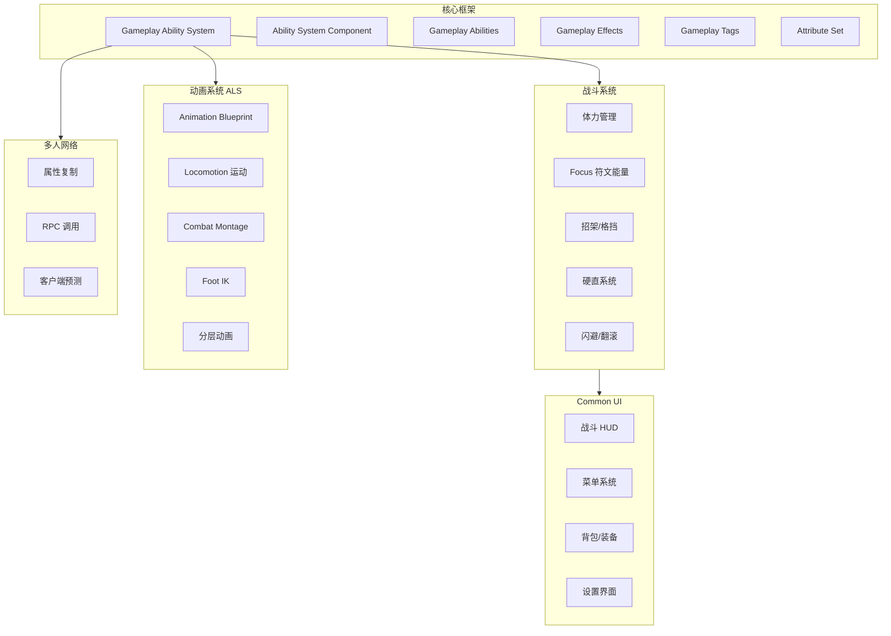

# 🎮 ZBeta 项目开发 Skill

> **目标游戏**: 类似《No Rest for the Wicked》(恶意不息) 的 Soulslike ARPG
> **技术栈**: GAS + ALS 动画系统 + Common UI + 多人联机

---

## 📋 项目核心系统架构



---

## 🎯 恶意不息核心系统对标

### 1. 属性系统 (Attribute Set)

| 恶意不息属性 | GAS 实现 | 说明 |
|-------------|---------|------|
| Health | `FGameplayAttributeData Health` | 生命值，归零死亡 |
| Stamina | `FGameplayAttributeData Stamina` | 体力，攻击/闪避/格挡消耗 |
| Focus | `FGameplayAttributeData Focus` | 符文能量，100点=1格 |
| Strength | `FGameplayAttributeData Strength` | 力量，影响力量系武器 |
| Dexterity | `FGameplayAttributeData Dexterity` | 敏捷，影响敏捷系武器 |
| Intelligence | `FGameplayAttributeData Intelligence` | 智力，影响法术武器 |
| Faith | `FGameplayAttributeData Faith` | 信仰，影响神圣武器 |
| EquipLoad | `FGameplayAttributeData EquipLoad` | 负重，影响闪避类型 |

**创建步骤:**
```cpp
// XBAttributeSet.h
UCLASS()
class UXBAttributeSet : public UAttributeSet
{
    GENERATED_BODY()
public:
    // Primary Attributes
    UPROPERTY(BlueprintReadOnly, ReplicatedUsing=OnRep_Health, Category="Vital", meta=(DisplayName="生命值"))
    FGameplayAttributeData Health;
    ATTRIBUTE_ACCESSORS(UXBAttributeSet, Health)
    
    UPROPERTY(BlueprintReadOnly, ReplicatedUsing=OnRep_Stamina, Category="Vital", meta=(DisplayName="体力"))
    FGameplayAttributeData Stamina;
    ATTRIBUTE_ACCESSORS(UXBAttributeSet, Stamina)
    
    UPROPERTY(BlueprintReadOnly, ReplicatedUsing=OnRep_Focus, Category="Vital", meta=(DisplayName="Focus能量"))
    FGameplayAttributeData Focus;
    ATTRIBUTE_ACCESSORS(UXBAttributeSet, Focus)
    
    // Combat Stats
    UPROPERTY(BlueprintReadOnly, ReplicatedUsing=OnRep_Poise, Category="Combat", meta=(DisplayName="硬直值"))
    FGameplayAttributeData Poise;
    ATTRIBUTE_ACCESSORS(UXBAttributeSet, Poise)
};
```

---

### 2. 战斗系统核心机制

#### 2.1 体力 (Stamina) 管理
```
攻击 → 消耗体力
格挡 → 消耗体力  
闪避 → 消耗体力 (受负重影响)
冲刺 → 持续消耗体力
体力归零 → 无法行动，易受攻击
```

**GAS 实现模式:**
- 使用 `UGameplayEffect` 的 `Duration` 类型处理体力恢复
- 使用 `Instant` 类型处理体力消耗
- 使用 `GameplayTag` 标记体力耗尽状态: `State.Exhausted`

#### 2.2 Focus 符文系统
```
攻击敌人 → 积累 Focus
成功招架 → 大量 Focus
使用符文技能 → 消耗 Focus (不消耗体力!)
```

**关键设计:**
- Focus 满100点 = 1格能量槽
- 符文技能绑定在武器上，可拆卸转移
- 符文技能不消耗体力，是高级战斗资源

#### 2.3 招架与硬直 (Parry & Poise)
```
精准招架 → 敌人硬直 + 大量 Focus
格挡 → 减少伤害但消耗体力
硬直归零 → 敌人进入处决状态
```

**GAS Tags 设计:**
```
Combat.Action.Parry          // 正在招架
Combat.Action.Block          // 正在格挡
Combat.State.Staggered       // 被硬直
Combat.State.Vulnerable      // 可处决状态
```

#### 2.4 闪避与负重
| 负重等级 | 闪避类型 | 体力消耗 | 无敌帧 |
|---------|---------|---------|-------|
| 轻装 (<30%) | 快速步伐 | 低 | 长 |
| 中装 (30-70%) | 翻滚 | 中 | 中 |
| 重装 (>70%) | 慢速推击 | 高 | 短 |

---

### 3. 装备系统架构

#### 3.1 武器数据结构
```cpp
USTRUCT(BlueprintType)
struct FXBWeaponData : public FTableRowBase
{
    GENERATED_BODY()
    
    // 基础信息
    UPROPERTY(EditAnywhere, BlueprintReadWrite, meta=(DisplayName="武器名称"))
    FText WeaponName;
    
    UPROPERTY(EditAnywhere, BlueprintReadWrite, meta=(DisplayName="武器类型"))
    EXBWeaponType WeaponType; // Sword, Dagger, Bow, Staff...
    
    UPROPERTY(EditAnywhere, BlueprintReadWrite, meta=(DisplayName="稀有度"))
    EXBRarity Rarity; // Common, Rare, Cursed, Unique
    
    // 属性需求
    UPROPERTY(EditAnywhere, BlueprintReadWrite, meta=(DisplayName="力量需求"))
    int32 RequiredStrength;
    
    UPROPERTY(EditAnywhere, BlueprintReadWrite, meta=(DisplayName="敏捷需求"))
    int32 RequiredDexterity;
    
    // 符文槽
    UPROPERTY(EditAnywhere, BlueprintReadWrite, meta=(DisplayName="符文槽数量"))
    int32 RuneSlots;
    
    // 耐久度
    UPROPERTY(EditAnywhere, BlueprintReadWrite, meta=(DisplayName="最大耐久"))
    float MaxDurability;
};
```

#### 3.2 稀有度枚举
```cpp
UENUM(BlueprintType)
enum class EXBRarity : uint8
{
    Common   UMETA(DisplayName="普通-白色"),    // 最高可定制
    Rare     UMETA(DisplayName="稀有-蓝色"),    // 带正面附魔
    Cursed   UMETA(DisplayName="诅咒-紫色"),    // 强力但有负面效果
    Unique   UMETA(DisplayName="传说-金色")     // 独特附魔
};
```

---

### 4. Common UI 架构

#### 4.1 Widget 层级结构
```
UXBPrimaryGameLayout (根布局)
├── UXBHUDWidget (战斗 HUD)
│   ├── HealthBar
│   ├── StaminaBar
│   ├── FocusBars (多格能量槽)
│   ├── EquippedItems (快捷道具)
│   └── EnemyHealthBar (锁定敌人血条)
│
├── WidgetStack_Menu (菜单栈)
│   ├── PauseMenu
│   ├── InventoryScreen
│   ├── EquipmentScreen
│   └── SettingsMenu
│
└── WidgetStack_Popup (弹窗栈)
    ├── ConfirmDialog
    ├── ItemPickup
    └── LevelUpNotification
```

#### 4.2 Common UI 核心类
```cpp
// 主布局 - 管理所有 Widget Stack
UCLASS()
class UXBPrimaryGameLayout : public UCommonUserWidget
{
    GENERATED_BODY()
public:
    // 使用 Gameplay Tag 注册栈
    UPROPERTY(meta=(BindWidget))
    TObjectPtr<UCommonActivatableWidgetStack> Stack_Menu;
    
    UPROPERTY(meta=(BindWidget))
    TObjectPtr<UCommonActivatableWidgetStack> Stack_Popup;
    
    // 异步推送 Widget
    UFUNCTION(BlueprintCallable, Category="UI")
    void PushWidgetToStack(FGameplayTag StackTag, TSubclassOf<UCommonActivatableWidget> WidgetClass);
};
```

#### 4.3 手柄/键鼠自适应
```cpp
// Common UI 自动处理输入切换
// 在 CommonInputActionDataBase 中配置按键映射
// UI 会自动显示对应平台的按键图标
```

---

## 🔧 开发工作流

### Phase 1: 基础框架 (1-2周)
- [ ] 创建 `UXBAttributeSet` 包含所有核心属性
- [ ] 创建 `UXBAbilitySystemComponent` 自定义 ASC
- [ ] 配置 `GameplayTags` 层级结构
- [ ] 创建基础 `UGameplayEffect` 模板 (伤害、恢复、Buff)

### Phase 2: 战斗核心 (2-3周)
- [ ] 实现体力消耗/恢复机制
- [ ] 实现 Focus 积累系统
- [ ] 创建招架 `GA_Parry` 能力
- [ ] 创建闪避 `GA_Dodge` 能力 (根据负重变化)
- [ ] 实现硬直/处决系统

### Phase 3: 动画系统 (2-3周)
- [ ] 创建 ALS 风格 Animation Blueprint
- [ ] 实现 Locomotion 状态机
- [ ] 配置 Distance Matching
- [ ] 实现战斗动画层
- [ ] 配置 Foot IK

### Phase 4: UI 系统 (2周)
- [ ] 创建 `UXBPrimaryGameLayout` 主布局
- [ ] 实现战斗 HUD (HP/Stamina/Focus)
- [ ] 创建装备/背包界面
- [ ] 实现设置菜单
- [ ] 配置手柄支持

### Phase 5: 网络同步 (1-2周)
- [ ] 配置属性复制
- [ ] 实现能力预测
- [ ] 测试多人战斗同步

---

## 📝 代码规范速查

### Gameplay Tags 命名约定
```
Character.State.Dead           // 状态
Character.State.Invulnerable
Combat.Action.Attack.Light     // 动作
Combat.Action.Attack.Heavy
Combat.Action.Parry
Combat.Action.Dodge
Ability.Skill.Rune.FireSlash   // 能力
Ability.Skill.Rune.IceNova
Damage.Type.Physical           // 伤害类型
Damage.Type.Fire
Damage.Type.Holy
Equipment.Weapon.Sword         // 装备
Equipment.Armor.Plate
Input.Action.Attack            // 输入
Input.Action.Dodge
```

### GAS 三件套创建模板
```cpp
// 1. Gameplay Ability (GA)
UCLASS()
class UGA_XBDodge : public UXBGameplayAbility
{
    // 能力逻辑
};

// 2. Gameplay Effect (GE) - 通常用蓝图/数据资产
// GE_StaminaCost_Dodge.uasset

// 3. Gameplay Cue (GC) - 视觉/音效反馈
UCLASS()
class UGC_Dodge : public UGameplayCueNotify_Static
{
    // 播放闪避特效/音效
};
```

### 常用宏
```cpp
// 属性访问器
ATTRIBUTE_ACCESSORS(UXBAttributeSet, Health)

// Log
UE_LOG(LogXB, Warning, TEXT("Combat: %s dealt %f damage"), *GetName(), Damage);

// Assert
ensureMsgf(AbilitySystemComponent, TEXT("ASC is null on %s"), *GetName());
```

---

## 🔗 参考资源

### Udemy 课程
1. **GAS RPG Course** (Stephen Ulibarri) - GAS 架构核心
2. **ALS Animation Course** (Unreal Magic) - 动画系统
3. **Common UI Course** (Vince Petrelli) - UI 框架

### 官方文档
- [Gameplay Ability System](https://docs.unrealengine.com/5.0/en-US/gameplay-ability-system-for-unreal-engine/)
- [Common UI Plugin](https://docs.unrealengine.com/5.0/en-US/common-ui-plugin-for-advanced-user-interfaces-in-unreal-engine/)
- [Enhanced Input System](https://docs.unrealengine.com/5.0/en-US/enhanced-input-in-unreal-engine/)

### 社区资源
- GASDocumentation (GitHub)
- Lyra Starter Game (Epic 官方示例)

---

## 🚀 快速开始命令

### 创建新能力
```
/create-ability <AbilityName>
```

### 创建新属性
```
/add-attribute <AttributeName>
```

### 创建 UI Widget
```
/create-widget <WidgetName> <ParentClass>
```

---

> **提示**: 开发时优先完成 C++ 核心逻辑，再用蓝图配置数据和资产。遵循 SOLID 原则，保持代码可扩展性。
